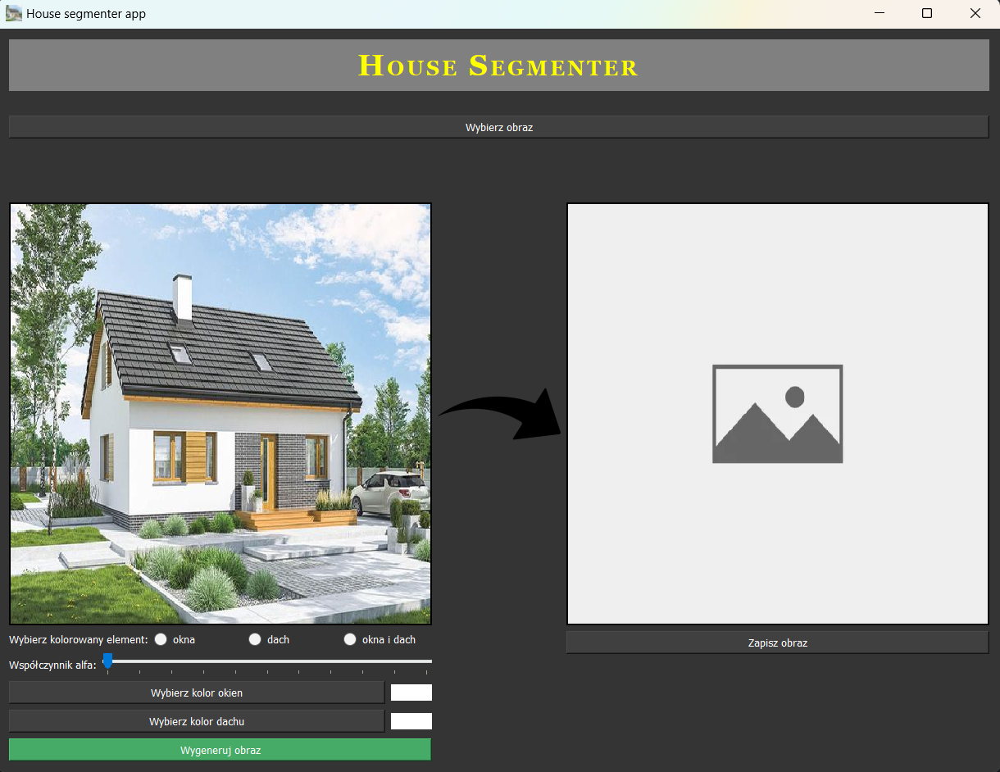

# HOUSE SEGMENTER
### 1. Description
House Segmenter is a university project that recognise windows and roofs from house image and colorise them (with given transparency/alpha channel value). 

### 2. Model
Model was trained using dataset containing 1000 houses photos. 
Accuracy of the model is around 70% (via UNet method). 

### 3. Program window

### 4. Use
Firstly, you'll have to upload photo from your local storage to program, then set colors, transparency (0%-100% scale, 0% means no coloring, 100% means full color) and section(s) to color.
To see results, you have to click to button below color pickers. You can save output image clicking button under colored picture.

### 5. Authors
[ebronx](https://github.com/ebronx/)  
[masia-pasia](https://github.com/masia-pasia)  
[mradamones](https://github.com/mradamones/)  
[Sp4c3DucK](https://github.com/Sp4c3DucK)  
[Woleek](https://github.com/Woleek)